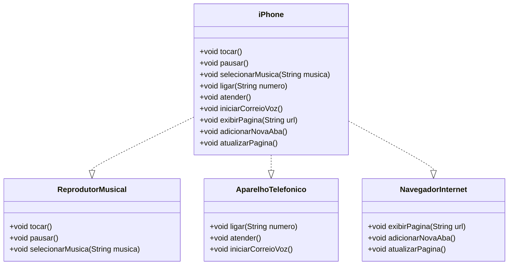

# iPhone Component Model

Este projeto modela um componente iPhone que implementa funcionalidades básicas de Reprodutor Musical, Aparelho Telefônico e Navegador na Internet. A modelagem é feita através de um diagrama UML, e as funcionalidades são representadas em Java por meio de interfaces e uma classe principal `iPhone` que implementa essas interfaces.

## Funcionalidades

O iPhone de 2007 possuía três funcionalidades principais:

1. **Reprodutor Musical**
   - **Métodos:** `tocar()`, `pausar()`, `selecionarMusica(String musica)`

2. **Aparelho Telefônico**
   - **Métodos:** `ligar(String numero)`, `atender()`, `iniciarCorreioVoz()`

3. **Navegador na Internet**
   - **Métodos:** `exibirPagina(String url)`, `adicionarNovaAba()`, `atualizarPagina()`

## Diagrama UML

Abaixo está o diagrama UML que representa a estrutura do componente iPhone, usando a sintaxe Mermaid:

